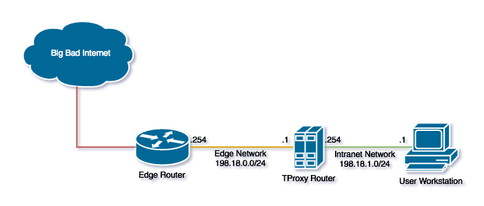

Golang TProxy Example
=====================

The Golang TProxy Example is designed to intercept all UDP and TCP traffic and log the
source and destination of the connection then stream data between the source and destination.

This is simply to show a working proof of concept for intercepting internet traffic.

Getting Started
===============

  1. Start the vagrant virtual machines: `vagrant up`
  2. Compile the example for linux: `env GOOS="linux" GOARCH="amd64" go build -o tproxy.bin tproxy_example.go`
  3. Log onto the TProxy router: `vagrant ssh tproxy`
  4. Start the TProxy example: `sudo /vagrant/tproxy.bin`
  5. Connect a client machine to the intranet network

Network Topology
================

The network topology of this example is pretty simple, it is made up of three hosts:

  * **Edge Router** The edge router provides a place to view traffic after it has been proxyed, all 
  traffic is masqueraded to leave eth0
  
  * **TProxy Router** The TProxy host runs the compiled example to intercept all TCP and UDP traffic
  then route it upstream to **Edge Router**
  
  * **User Workstation** The workstation is of your own choosing but is used to produce traffic to 
  intercept on the TProxy router